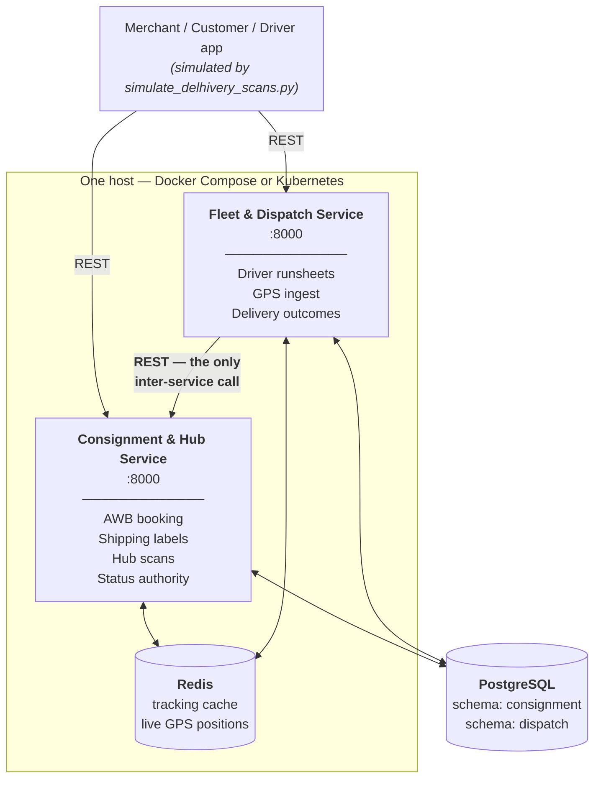
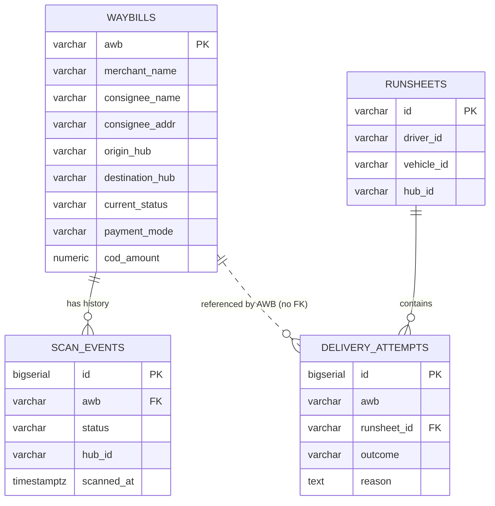
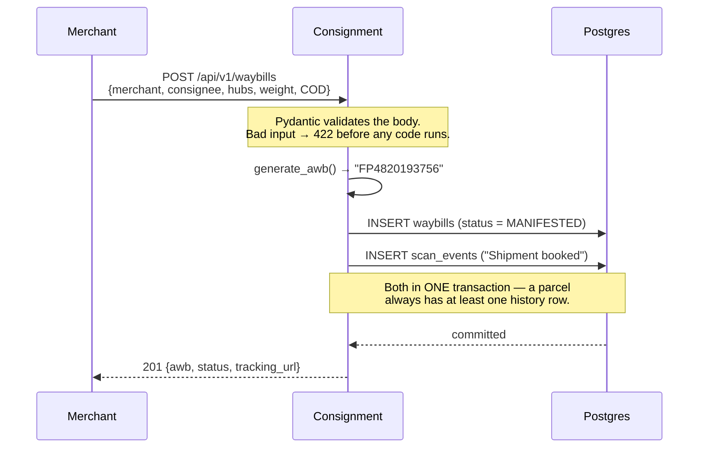
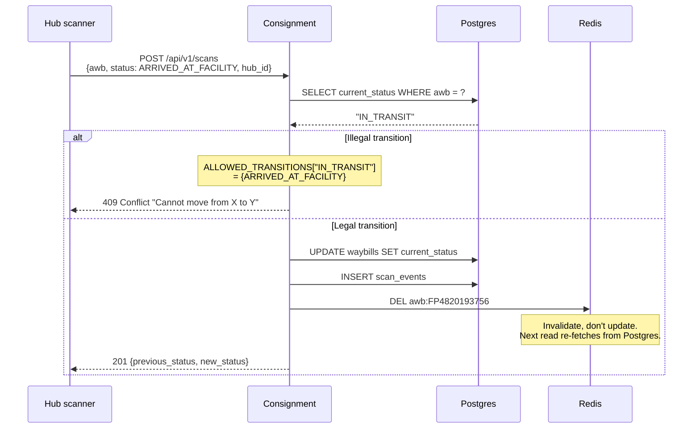
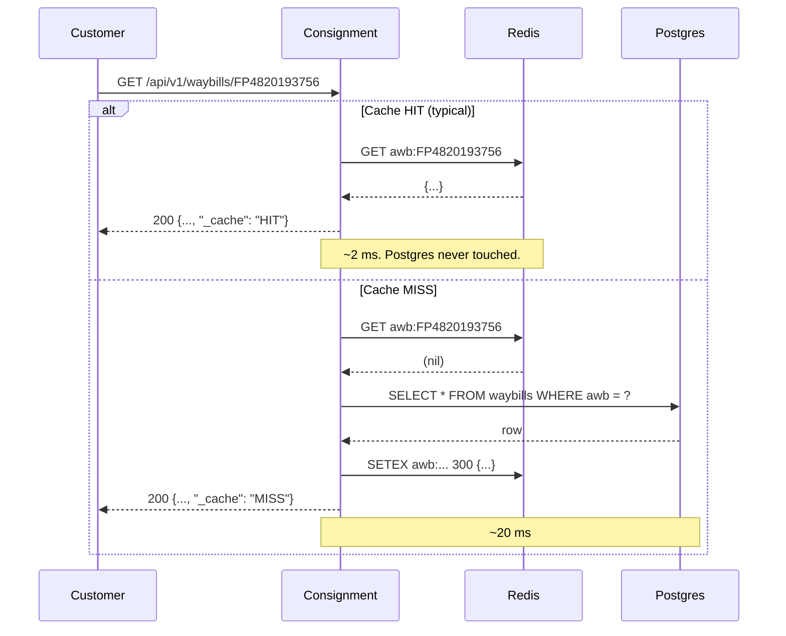
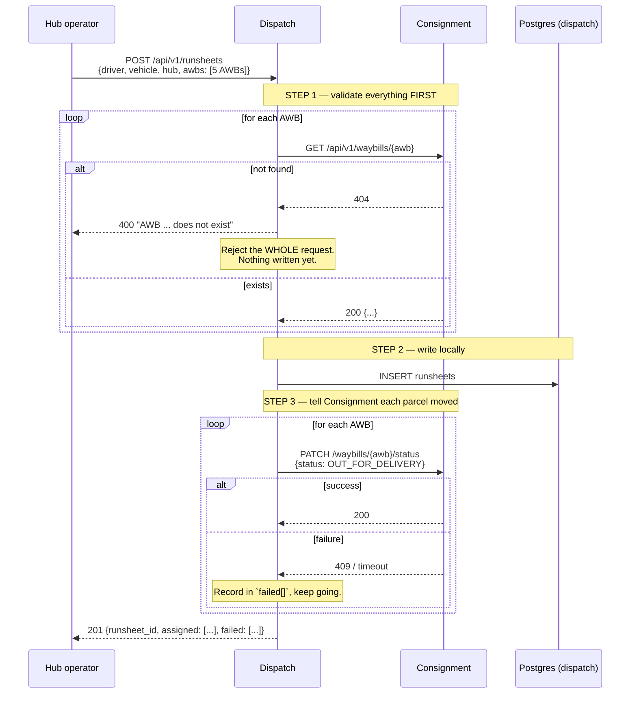
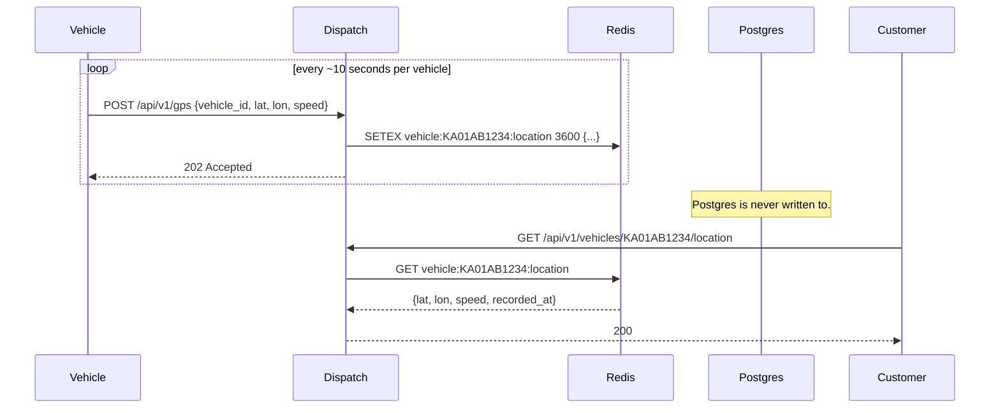
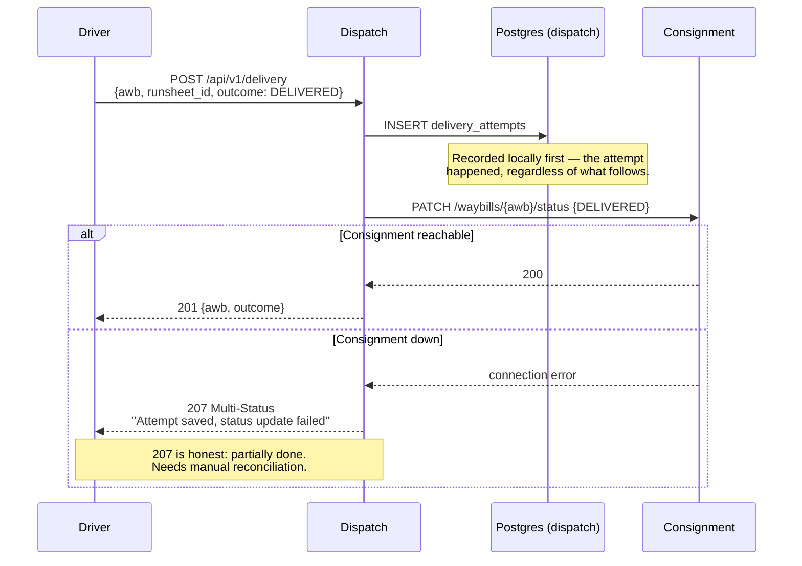
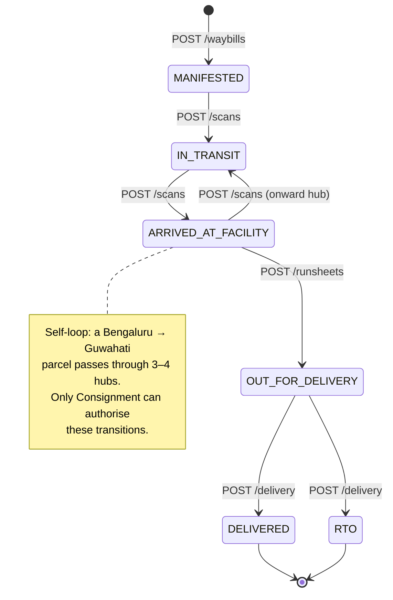
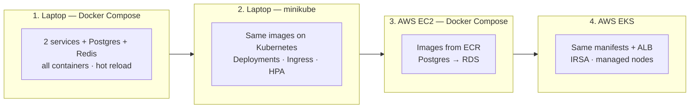

# How FleetPulse Works

The architecture and runtime behaviour of the two-service FleetPulse system, end to end.

This describes the design in [FleetPulse-Simple.md](FleetPulse-Simple.md) — the one you are
actually building. Two optional add-ons are specified separately so the core stays small:
[Observability](FleetPulse-Addon-Observability.md) and
[Notification Service](FleetPulse-Addon-Notification.md).

---

## 1. What the system does

FleetPulse models the operational spine of a parcel logistics network — the part of Delhivery that
moves a package from a merchant's warehouse to a customer's door.

A parcel's real-world journey looks like this:

> A merchant books a shipment. FleetPulse issues an **AWB** (airway bill number) and a printable
> label. The parcel is collected and scanned into the origin facility, travels between sorting hubs
> on line-haul vehicles, and arrives at the facility nearest the customer. There it is assigned to a
> driver's **runsheet** for the day. The driver's vehicle reports GPS positions while out. Finally
> the parcel is either **delivered** (proof of delivery captured) or, after failed attempts, sent
> **RTO** — return to origin.

Every one of those steps is an API call in FleetPulse. The system's job is to know where every
parcel is, who is responsible for it right now, and what happened to it.

---

## 2. The pieces



| Component | Responsibility | Why it exists separately |
|---|---|---|
| **Consignment & Hub Service** | Owns the parcel record and its status. Books AWBs, generates labels, records facility scans. | This is the *system of record*. Every status change in the business must go through it. |
| **Fleet & Dispatch Service** | Owns drivers, vehicles, runsheets, and delivery attempts. | Different data, different change rate, different failure tolerance. Last-mile churns constantly; parcel records do not. |
| **PostgreSQL** | Durable truth. Two schemas, one database. | Anything you would be upset to lose. |
| **Redis** | Tracking cache + last-known vehicle position. | Two workloads that would otherwise abuse Postgres. |

### 2.1 The one rule that makes this "microservices"

**Dispatch never touches Consignment's tables.** It asks over HTTP.

That single constraint is what separates a microservices system from one application with two
folders. Dispatch could trivially run `UPDATE consignment.waybills SET current_status = ...` — the
database connection is right there, same instance, same credentials. It must not.

Why it matters: Consignment enforces the legal state transitions (§4.2). If Dispatch wrote directly
to the table, that rule would live in two places and eventually disagree. The HTTP boundary makes
the rule enforceable in exactly one place.

### 2.2 Dependency direction

The arrow points one way: **Dispatch → Consignment.** Consignment never calls Dispatch.

This is deliberate. Circular dependencies between services create startup ordering problems, cascading
timeouts, and deadlocks that are painful to debug. When you add a third service
([notifications](FleetPulse-Addon-Notification.md)), keep the graph acyclic.

---

## 3. Data model



Three design choices worth understanding:

**`scan_events` is append-only.** You never `UPDATE` it. `waybills.current_status` is a
denormalised convenience column — fast to read — but `scan_events` is the truth, and you could
rebuild `current_status` from it at any time. This is why tracking history is trustworthy.

**`delivery_attempts.awb` has no foreign key.** It points at a table in the *other* service's schema.
A real FK would create a hard database-level coupling that makes splitting the services later
impossible. The reference is by value, validated over HTTP at write time.

**There is no `gps_pings` table.** Deliberately. See §4.5.

---

## 4. Request flows

### 4.1 Booking a parcel



The two inserts share a transaction. If the second failed independently you would have parcels with
no history, and the audit trail would silently have holes.

### 4.2 Recording a hub scan — where the rules live



The state machine is a plain Python dict:

```python
ALLOWED_TRANSITIONS = {
    "MANIFESTED":          {"IN_TRANSIT"},
    "IN_TRANSIT":          {"ARRIVED_AT_FACILITY"},
    "ARRIVED_AT_FACILITY": {"IN_TRANSIT", "OUT_FOR_DELIVERY"},
    "OUT_FOR_DELIVERY":    {"DELIVERED", "RTO"},
    "DELIVERED":           set(),   # terminal
    "RTO":                 set(),   # terminal
}
```

A parcel cannot jump from `MANIFESTED` straight to `DELIVERED`. Attempting it returns 409 rather
than silently corrupting the record. This catches real bugs — a retried request, an out-of-order
scan, a driver app double-submitting.

**On cache invalidation:** notice the code deletes the key rather than writing the new value. Both
work, but delete-on-write is harder to get wrong. If you update the cache and the transaction later
rolls back, the cache now holds data that was never committed. Deleting is always safe.

### 4.3 Tracking lookup — the hot path



This is the most-called endpoint in any logistics system — customers refresh tracking pages
obsessively. Caching it with a 5-minute TTL is the single highest-leverage performance decision in
the app.

**Redis failing must not break tracking.** Every cache helper swallows its exception and returns
`None`:

```python
def cache_get(key: str) -> dict | None:
    try:
        raw = _r.get(key)
        return json.loads(raw) if raw else None
    except Exception as e:
        log.warning("cache read failed (continuing without cache): %s", e)
        return None   # ← behaves exactly like a cache miss
```

A Redis outage degrades the system to "slower." A cache that can take down your application is
worse than having no cache.

### 4.4 Creating a runsheet — the cross-service call

This is the most important flow to understand. It is the only place two services talk.



**Validate-then-write is the pattern.** Step 1 checks every AWB before step 2 writes anything, so a
single bad AWB rejects the whole request rather than half-creating a runsheet.

**Step 3 can partially fail, and the response says so honestly.** Without a message broker there is
no way to make "create runsheet" and "update 5 parcels" atomic. So the API returns both lists:

```json
{
  "runsheet_id": "RS-20260813-01-417",
  "assigned": ["FP4820193756", "FP1029384756", "FP5647382910"],
  "failed": [
    { "awb": "FP9988776655", "error": "Illegal status change: already DELIVERED" }
  ]
}
```

This is the real trade-off of synchronous REST, and naming it plainly is better than hiding it.
[The notification add-on](FleetPulse-Addon-Notification.md) introduces the outbox pattern, which is
how you fix this class of problem without adopting a broker.

### 4.5 GPS pings — the path that avoids the database



**Why GPS never reaches Postgres.** Do the arithmetic: 100 vehicles pinging every 10 seconds is
864,000 writes per day. A `db.t3.micro` would spend its entire IO budget on data whose value expires
in ten seconds — only the newest ping matters. Redis holds one key per vehicle with a 1-hour TTL, so
a vehicle that stops reporting disappears on its own with no cleanup job.

**Note the `202 Accepted`, not `201 Created`.** The API is telling the truth: this was accepted, and
it is not durable. If Redis restarts, positions are lost and rebuild within ten seconds.

This "high-write, low-durability data does not belong in your relational database" reasoning is a
genuine architectural decision, and a good one to be able to defend.

### 4.6 Delivery — closing the loop



The `207` response is deliberate. A `500` would suggest nothing happened; a `201` would claim
everything worked. Neither is true. This is exactly the gap an outbox table closes — see the
[notification add-on](FleetPulse-Addon-Notification.md).

---

## 5. Parcel lifecycle



Which service triggers each transition:

| Transition | Triggered by | Endpoint |
|---|---|---|
| → `MANIFESTED` | Consignment | `POST /waybills` |
| → `IN_TRANSIT` | Consignment | `POST /scans` |
| → `ARRIVED_AT_FACILITY` | Consignment | `POST /scans` |
| → `OUT_FOR_DELIVERY` | **Dispatch**, via HTTP | `PATCH /waybills/{awb}/status` |
| → `DELIVERED` / `RTO` | **Dispatch**, via HTTP | `PATCH /waybills/{awb}/status` |

Dispatch drives the last three transitions but does not *perform* them — it asks Consignment to.

---

## 6. When things break

Honest failure analysis, because this is what interviews probe and what production actually does.

| Failure | Effect | Why it behaves that way |
|---|---|---|
| **Redis down** | Tracking still works, just slower. GPS endpoints 500. | Cache helpers fail soft; GPS has no fallback store by design. |
| **Consignment down** | Booking, tracking, scans all fail. Dispatch can still record GPS and delivery attempts locally, but returns 207. | Consignment is the system of record — nothing routes around it. |
| **Dispatch down** | Booking, tracking, and hub scans unaffected. | Nothing depends on Dispatch. This is why the dependency arrow points one way. |
| **Postgres down** | Everything fails except cached tracking reads and GPS. | Correct: better to reject writes than accept ones you cannot persist. |
| **Consignment slow (not down)** | Runsheet creation slows or times out at 5s. | `httpx.Timeout(5.0, connect=2.0)` bounds it. Without a timeout, one slow call would hang a worker indefinitely. |
| **Partial runsheet failure** | Some parcels assigned, some not. Reported in `failed[]`. | No transaction spans two services over HTTP. |

**The single-point-of-failure is Consignment**, and that is a real property of this design, not an
oversight. It is the system of record; making it optional would mean giving up the guarantee that
parcel status has one authority.

---

## 7. The same app in four environments

The application code never changes. Only configuration does.



| | Local Compose | minikube | EC2 Compose | EKS |
|---|---|---|---|---|
| Postgres | container | container | **RDS** | RDS or in-cluster |
| Redis | container | pod | container | pod |
| Images | built locally | built into minikube | **ECR** | ECR |
| Ingress | published ports | NGINX Ingress | published ports | **ALB** |
| Service discovery | Compose DNS | K8s DNS | Compose DNS | K8s DNS |
| Config | `.env` | ConfigMap + Secret | `.env` | ConfigMap + Secret |
| Cost | $0 | $0 | $0 free tier | ~$5/mo burst |

Notice service discovery: `http://consignment-service:8000` is the same URL in all four. Docker
Compose and Kubernetes both provide DNS by service name. That is not a coincidence — it is why the
code needs no environment branching.

---

## 8. Deliberate omissions

Things a production system would have that this one does not, and why that is the right call here.

| Missing | Why it is fine | When to add it |
|---|---|---|
| Authentication | No real user data; SGs restrict access to your IP | Before anything is genuinely public |
| Message broker | Two services, one call between them | When a third consumer needs the same events |
| Database per service | Two services do not justify it — separate *schemas* mark the boundary | When teams own services independently |
| Retries / circuit breakers | Failures are visible and reported honestly | When cross-service calls become frequent |
| Distributed tracing | Two services, one hop — logs are enough | [Observability add-on](FleetPulse-Addon-Observability.md) |
| Horizontal scaling | Single instance handles simulator load easily | Kubernetes HPA exercise |
| Rate limiting | No public exposure | Before public exposure |

Being able to say *"I left that out on purpose, and here is when I would add it"* is far stronger
than having built everything.

---

## 9. Extending it

Two add-ons, written to be applied **after** the core works. Each is self-contained and neither
requires changes to the other.

### [→ Observability Add-On](FleetPulse-Addon-Observability.md)
Structured logging, a `/metrics` endpoint with domain-specific metrics, Prometheus + Grafana,
dashboards, alerts, and optional OpenTelemetry tracing. Staged so each step is independently useful.

### [→ Notification Service Add-On](FleetPulse-Addon-Notification.md)
A third service that pushes status updates to merchants — **without introducing a message broker**.
Uses a Postgres outbox table and a polling worker, which is also how you fix the partial-failure
problem from §4.4 and §4.6.

Recommended order: **core → observability → notifications.** Add observability first so that when
the notification worker misbehaves, you can already see it.
