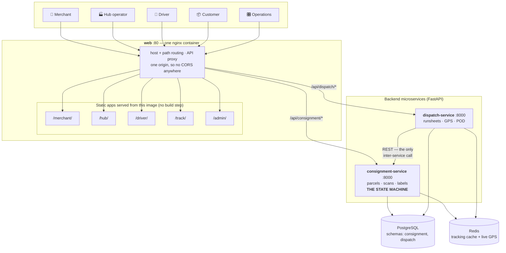
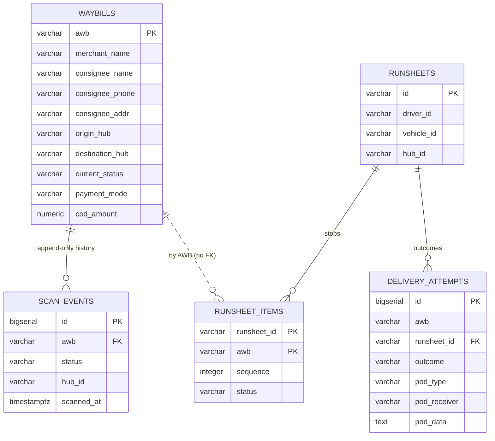
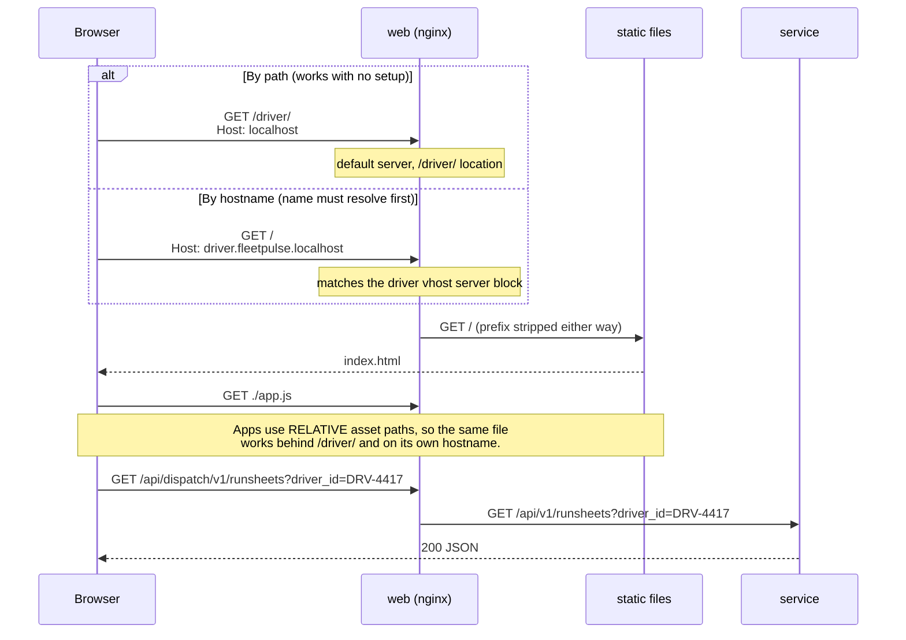
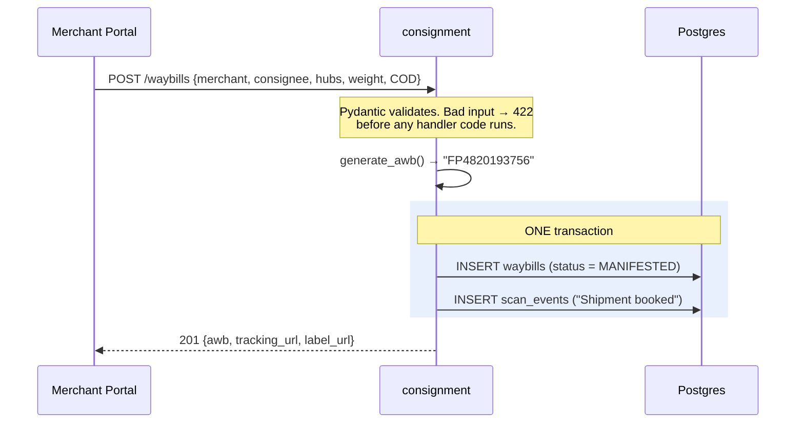
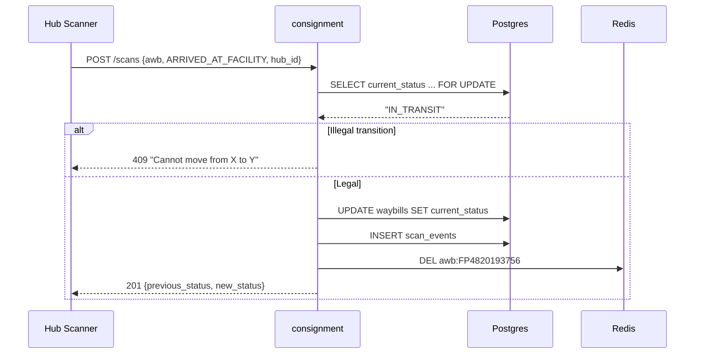
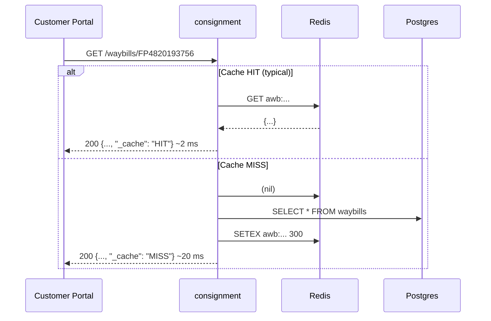
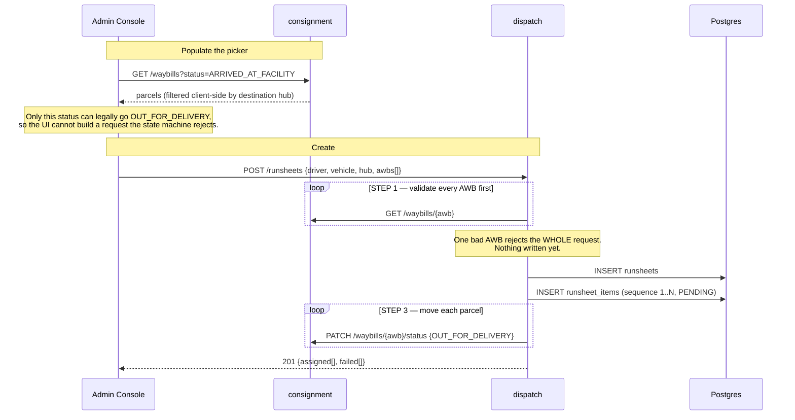
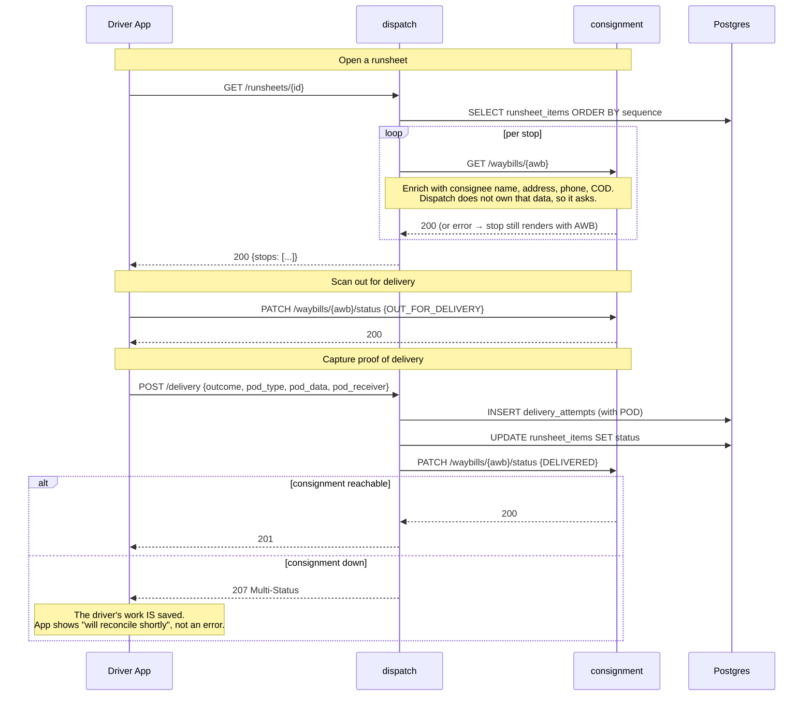
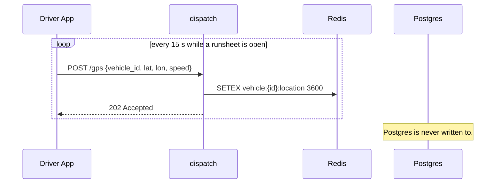
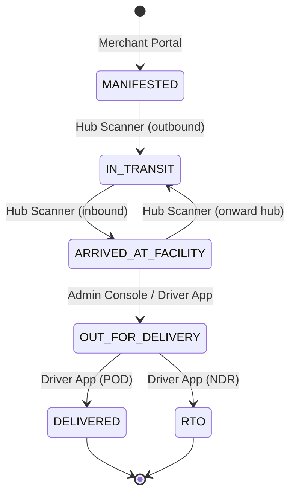

# How FleetPulse Works

The architecture and runtime behaviour of the whole system: five front-end applications served by a
single nginx container, two backend microservices, PostgreSQL and Redis — **five containers**, one
command.

Companion documents: [FleetPulse-Apps.md](FleetPulse-Apps.md) (front-end structure and the full API
surface) and [FleetPulse-Simple.md](FleetPulse-Simple.md) (the build plan).

---

## 1. What the system does

FleetPulse models the operational spine of a parcel logistics network — the part of Delhivery that
moves a package from a merchant's warehouse to a customer's door.

> A merchant books a shipment. FleetPulse issues an **AWB** (airway bill number) and a printable
> label. The parcel is scanned into the origin facility, travels between sorting hubs on line-haul
> vehicles, and arrives at the facility nearest the customer. There it is assigned to a driver's
> **runsheet**. The driver's vehicle reports GPS while out. Finally the parcel is **delivered**
> (proof captured) or, after failed attempts, sent **RTO** — return to origin.

Five kinds of user touch a parcel, and each gets their own interface. The system's job is to know
where every parcel is, who is responsible for it right now, and what happened to it.

---

## 2. The whole system



**Five containers.** Every app is reachable two ways — its own hostname
(`driver.fleetpulse.localhost`) or a path under localhost (`/driver/`), both always live. See
[FleetPulse-Apps.md §1](FleetPulse-Apps.md).

> This was ten containers until recently: a gateway plus one nginx per app. They were consolidated
> because static assets have no independent scaling profile, no state and no independent lifecycle
> — and since every app embeds `packages/web-shared`, a change there rebuilt all five images
> anyway. The per-app ports 3001–3005 no longer exist. See
> [FleetPulse-Architecture-Review.md](FleetPulse-Architecture-Review.md).

### 2.1 Component responsibilities

| Component | Owns | Notes |
|---|---|---|
| **web** | Nothing | nginx. Serves all five apps as static files, proxies `/api/*`, hosts the launcher |
| ↳ `/merchant/` | — | Booking. Bulk upload and labels not built |
| ↳ `/hub/` | — | High-speed inbound/outbound scanning |
| ↳ `/driver/` | — | Runsheets, out-for-delivery scan, POD, GPS |
| ↳ `/track/` | — | Public tracking; the AWB is the only credential |
| ↳ `/admin/` | — | Network-wide ops. **The only place a runsheet can be created** |
| **consignment-service** | Waybills, scan events, parcel status | **System of record.** Owns `ALLOWED_TRANSITIONS` |
| **dispatch-service** | Runsheets, stops, delivery attempts, POD | Drives the last three transitions, performs none of them |
| **PostgreSQL** | Durable truth | One database, two schemas |
| **Redis** | Tracking cache + last-known GPS | Two roles with opposite failure semantics (§6.2) |

The web tier holds **no state and no database access**. It is static HTML, CSS and ES modules,
calling HTTP APIs. That is why adding a sixth app, or rewriting one in React, changes nothing
behind it.

**Every port except `80` binds `127.0.0.1`.** Before that was fixed, Postgres, Redis (no password)
and the admin console were reachable from the whole LAN.

### 2.2 Three rules that define the design

**1. Dispatch never writes to the `consignment` schema.** Same database, same credentials, trivially
possible — and forbidden. Consignment enforces legal state transitions; if dispatch wrote directly,
that rule would live in two places and eventually disagree. All cross-service traffic goes through
`services/dispatch-service/app/consignment_client.py`.

**2. Dependencies point one way.** Dispatch → consignment, never the reverse. Circular service
dependencies create startup-ordering problems and cascading timeouts.

**3. Front-ends never talk to a database.** They call HTTP APIs through the web tier. Obvious, but it
is why swapping any app for React, or adding a sixth, changes nothing behind it. The admin
console proved this: it was built entirely from endpoints that already existed.

---

## 3. Data model



Four choices worth understanding:

**`scan_events` is append-only.** Never updated or deleted. `waybills.current_status` is a
denormalised convenience column that could be rebuilt from it at any time. This is why the tracking
history a customer sees is trustworthy.

**`runsheet_items` exists because the driver app needed it.** Before it, `runsheets` recorded *who*
was driving and `delivery_attempts` recorded what had *already* been attempted — nothing recorded
what was **on** the runsheet. "What am I delivering today?" was unanswerable.

**No FK crosses a schema boundary.** `runsheet_items.awb` and `delivery_attempts.awb` point at
`consignment.waybills` by value. A real FK would couple the schemas at the database level and make a
future service split impossible. AWBs are validated over HTTP instead.

**There is no `gps_pings` table.** Deliberately — see §4.7.

---

## 4. Request flows

### 4.1 Every request starts at the web tier



Every `server` block in `apps/web/nginx.conf` includes the same `api_locations.conf`, so `/api/*` resolves
same-origin **from whichever hostname you used**. That is what keeps **CORS out of this project
entirely** — the most common source of frontend/backend friction, designed out rather than
configured around.

Absolute asset paths would break this: `/app.js` requested from `localhost/driver/` escapes the
prefix and 404s. Every app therefore uses `./app.js` and `./base.css`.

### 4.2 Booking — Merchant Portal



Both inserts share a transaction, so a parcel can never exist without at least one history row.

### 4.3 Hub scan — where the rules live



`SELECT ... FOR UPDATE` holds the row for the transaction, so two concurrent scans of the same
parcel cannot both read the old status and both conclude their move is legal.

**Cache invalidation is `DEL`, never overwrite.** If you wrote the new value and the transaction
later rolled back, the cache would hold data that was never committed. Deleting is always safe.

### 4.4 Tracking — Customer Portal



The most-called endpoint in any logistics system — customers refresh tracking pages obsessively.
The portal fetches the parcel and its history in parallel.

### 4.5 Runsheet creation — Admin Console

The hand-off from the middle mile to the last mile, and the only write in the system that touches
both services' data in one user action.



**Validate-then-write** means a single bad AWB rejects the request rather than half-creating a
runsheet. Step 3 can still partially fail — no transaction spans two services over HTTP — so the
response carries both lists and the console renders the failures inline rather than hiding them.

`runsheet_items` is what makes the driver app possible; before it existed, "what am I delivering
today?" had no answer (§3).

### 4.6 Driver workflow — the cross-service call



**The enrichment loop is N+1 by design.** Runsheets cap at 50 stops, and the alternative — dispatch
reading `consignment.waybills` directly — breaks rule 1 in §2.2. If it ever became hot, the fix is a
batch endpoint on consignment, not a cross-schema `SELECT`.

**The 207 is deliberate.** A `500` would imply nothing happened; a `201` would claim everything
worked. Neither is true. This is the real cost of synchronous REST without a broker, and the
transactional outbox in [the notification add-on](FleetPulse-Addon-Notification.md) is how you close
it.

### 4.7 GPS — the path that avoids the database



100 vehicles pinging every 10 seconds is ~864,000 writes/day of data whose value expires in seconds.
Redis holds one key per vehicle with a 1-hour TTL, so a vehicle that stops reporting expires on its
own with no cleanup job.

**`202 Accepted`, not `201 Created`** — the API is being honest that the write is non-durable.

---

## 5. Parcel lifecycle



| Transition | Triggered from | Endpoint |
|---|---|---|
| → `MANIFESTED` | Merchant Portal | `POST /waybills` |
| → `IN_TRANSIT` | Hub Scanner | `POST /scans` |
| → `ARRIVED_AT_FACILITY` | Hub Scanner | `POST /scans` |
| → `OUT_FOR_DELIVERY` | **Admin Console** (bulk, on runsheet creation) or **Driver App** (per stop) | `POST /runsheets` or `PATCH /waybills/{awb}/status` |
| → `DELIVERED` / `RTO` | Driver App | `POST /delivery` → `PATCH …/status` |

Two apps can drive `OUT_FOR_DELIVERY`, and both go through the same `PATCH` on consignment —
the admin console indirectly, via `POST /runsheets`. Neither writes parcel status itself.

Every arrow is validated against `ALLOWED_TRANSITIONS` in consignment. The driver app additionally
*hides* illegal actions — "Complete delivery" is disabled until the parcel is `OUT_FOR_DELIVERY` —
but the backend enforces it regardless. UI restrictions are a courtesy; the 409 is the guarantee.

---

## 6. When things break

### 6.1 Failure matrix

| Failure | Effect | Why |
|---|---|---|
| **web container down** | Everything unreachable on :80. Backends still up on 127.0.0.1:8001/8002 | Single entry point is a single point of failure |

| **Redis down** | Tracking works, slower. GPS endpoints 503 | Two roles, two policies — §6.2 |
| **consignment down** | Booking, tracking, scans fail. Admin console's parcel list and picker fail. Driver can still record POD → 207 | It is the system of record |
| **dispatch down** | Merchant, hub and customer apps unaffected. Driver app and admin runsheet tab dead | Nothing depends on dispatch |
| **Postgres down** | All writes fail; cached tracking reads still succeed | Correct: reject rather than accept unpersistable writes |
| **consignment slow** | Runsheet detail slows, bounded at 5 s per call | `httpx.Timeout(5.0, connect=2.0)` |
| **Partial runsheet assign** | Some parcels assigned; `failed[]` lists the rest, rendered inline by the console | No transaction spans two services |

**consignment-service is the single point of failure**, and that is a property of the design, not an
oversight. Making the system of record optional would mean giving up the guarantee that parcel
status has exactly one authority.

### 6.2 The two Redis roles

| | consignment `cache.py` | dispatch `cache.py` |
|---|---|---|
| Role | **Cache** — Postgres is the truth | **Store** — nothing else holds GPS |
| On failure | Logs, returns `None`, behaves as a miss | Propagates; endpoints return **503** |
| Rationale | A cache that can down the service is worse than no cache | Silently discarding writes is worse than an error |

Do not harmonise these. Knowing which kind of Redis you have is the whole distinction.

```bash
docker compose stop redis
curl -s localhost/api/consignment/v1/waybills/$AWB        # 200 — still works
curl -s -o /dev/null -w '%{http_code}\n' \
     localhost/api/dispatch/v1/vehicles/KA01AB1234/location   # 503 — honest
docker compose start redis
```

---

## 7. Cross-cutting concerns

**Service discovery.** `http://consignment-service:8000` is the same URL in Docker Compose and in
Kubernetes — both provide DNS by service name. That is why no application code changes when moving
to a cluster.

**Configuration.** `.env.example` is the contract; `docker-compose.yml` carries defaults so the
stack starts without a `.env`. Missing config fails loudly with a message naming the variable, not
a bare `KeyError`.

**No authentication.** The driver "login" is a picker in `localStorage`; anyone can be any driver,
hub, or merchant. The customer portal is genuinely public — the AWB *is* the credential, matching
every real courier. See [FleetPulse-Apps.md §5](FleetPulse-Apps.md) for what real auth would take;
the short version is **backend first**, because auth added only in the frontend is decoration when
anyone can `curl` the API.

> ⚠️ The **admin console raises the stakes here.** It can create runsheets and read every parcel in
> the network. It must not be reachable beyond localhost until real auth exists — and when it is
> added, this is the app that needs a role check, not just a login.

**No build step.** Apps are HTML + CSS + ES modules served by nginx. `packages/web-shared` is copied
into each image at build time, so no app depends on another being up. The cost is that changing the
shared package requires rebuilding all six images.

**Container healthchecks bind IPv4.** In `nginx:alpine`, `localhost` resolves to `::1` first while
`listen 80` binds IPv4 only — so `wget http://localhost/healthz` returns *connection refused* from a
container that is serving perfectly. All six app images use `127.0.0.1` for this reason. A
healthcheck that always fails is worse than none: it makes `docker compose ps` lie.

---

## 8. Deployment topology

The application code never changes between environments — only configuration.

| | Local Compose | minikube | AWS EC2 | EKS |
|---|---|---|---|---|
| Postgres | container | container | **RDS** | RDS or in-cluster |
| Redis | container | pod | container | pod |
| Images | built locally | loaded into minikube | **ECR** | ECR |
| Routing | web nginx | **Ingress** | web nginx | **ALB Ingress** |
| App hostnames | hosts file | `/etc/hosts` + `minikube ip` | hosts file or DNS | **Route 53** |
| Service discovery | Compose DNS | K8s DNS | Compose DNS | K8s DNS |
| Config | `.env` | ConfigMap + Secret | `.env` | ConfigMap + Secret |

The web tier's nginx is deliberately Ingress-shaped — **host- and path-based routing to several backends from
one entry point** — which is exactly the Ingress resource model. Each `server { server_name … }`
block becomes an Ingress `rule.host`; each `location /x/` becomes a `path`. Moving to Kubernetes is
a translation of `apps/web/nginx.conf`, not a redesign. See
[FleetPulse-Kubernetes.md](FleetPulse-Kubernetes.md).

---

## 9. Deliberate omissions

| Missing | Why it is fine here | When to add it |
|---|---|---|
| Authentication | No real data; nothing is publicly exposed | Before anything is reachable from the internet |
| Message broker | Two services, one call between them | When a third consumer needs the same events |
| Database per service | Separate *schemas* already mark the boundary | When teams own services independently |
| Retries / circuit breakers | Failures are visible and reported honestly | When cross-service calls become frequent |
| Distributed tracing | Two services, one hop — logs suffice | [Observability add-on](FleetPulse-Addon-Observability.md) |
| Bulk operations | Single booking proves the model | Merchant portal's next milestone |
| Rate limiting | No public exposure | Before public exposure |

Being able to say *"I left that out on purpose, and here is when I would add it"* is stronger than
having built everything.

---

## 10. Extending it

**[→ FleetPulse-Apps.md](FleetPulse-Apps.md)** — front-end structure, the complete API surface
(built and specified), and the authentication design.

**[→ Observability Add-On](FleetPulse-Addon-Observability.md)** — structured logging, domain
metrics, Prometheus/Grafana, alerts, tracing. Worth more now that there are nine containers.

**[→ Notification Add-On](FleetPulse-Addon-Notification.md)** — a third service using a
transactional outbox, which also removes the 207 from §4.5.

**[→ Kubernetes](FleetPulse-Kubernetes.md)** — minikube and EKS.

Recommended order: **observability → notifications → Kubernetes.** Add observability first so that
when something misbehaves, you can already see it.
